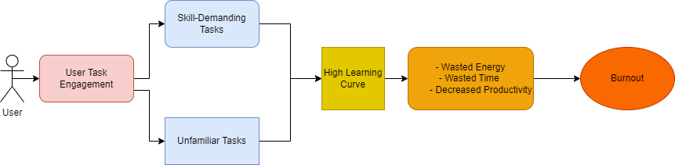

# SkillSync

**Align Your Skills, Elevate Your Tasks.**

SkillSync is an AI-powered productivity companion designed to help you align your tasks with your unique skills and experience. By intelligently analyzing your abilities and the demands of your tasks, SkillSync ensures you’re working on the right things at the right time—minimizing burnout and maximizing efficiency. Whether you’re tackling unfamiliar challenges or leveraging your expertise, SkillSync provides personalized recommendations to keep you in flow and on track.

## Problem Statement  
Many individuals struggle with tasks that are either too unfamiliar or too demanding for their current skill level, leading to frustration, inefficiency, and burnout. Without proper alignment between their abilities and the tasks they undertake, users often waste time, energy, and motivation. **SkillSync** addresses this challenge by intelligently matching tasks to users’ skills and experience, ensuring they work on the right tasks at the right time—maximizing productivity and minimizing stress.

## Stakeholders/End Users  

### **Primary Users**:  
1. **Professionals**: Individuals managing complex workloads who need to prioritize tasks that align with their expertise.  
2. **Students**: Learners juggling academic tasks and skill development, seeking to balance familiarity and growth.  
3. **Freelancers**: Independent workers who need to efficiently match their diverse skill sets to client demands.  
4. **Career Transitioners**: Individuals exploring new fields who need guidance on applying transferable skills to unfamiliar tasks.  

### **Secondary Users**:  
1. **Teams**: Groups that want to align team members’ skills with collective goals.  
2. **Managers/Leaders**: Supervisors who want to delegate tasks effectively based on team members’ strengths.  
3. **HR Departments**: Organizations looking to optimize employee productivity and reduce burnout through better task alignment.  

## Product Roadmap  

### **Product Vision**:  
Empower users to achieve their goals with confidence and efficiency by aligning their tasks with their unique skills and experience. **SkillSync** transforms productivity by ensuring users focus on what they do best while growing in areas that matter most.  

### **Product Strategy (Project Scope)**:  
1. **Core Focus**:  
   - Develop an AI-driven system that matches tasks to user skills and experience.  
   - Prioritize tasks based on **Skill Transferability** and **Task Novelty** to minimize burnout and maximize productivity.  

2. **Key Deliverables**:  
   - **User Input Modules**: Task lists, skill inputs (paragraph or list), and experience inputs (CV upload or paragraph).  
   - **AI Analysis Engine**: Calculate Skill Transferability and Task Novelty to generate personalized recommendations.  
   - **Output Tools**: Aligned tasks, Kanban Board, rank explanations, and user feedback mechanisms.  
   - **Reinforcement Learning**: Continuously improve recommendations based on user feedback and task completion data.  

3. **Future Expansions**:  
   - **Team Collaboration**: Extend task alignment to team-based workflows.  
   - **Skill Development Plans**: Suggest learning resources for tasks with high novelty.  
   - **Integration with Productivity Tools**: Sync with tools like Trello, Notion, or Google Tasks.  
   - **Network Effects**: Leverage aggregated user data to improve task recommendations globally.  

## Problem Representation

## Why SkillSync?

In a world where burnout is common and productivity is key, SkillSync bridges the gap between what you can do and what you need to do. It’s not just a task manager—it’s your personal productivity coach, helping you work smarter, grow steadily, and achieve more.

## How It Helps

- **Reduces Burnout**: By matching tasks to your skills, SkillSync ensures you’re not overwhelmed by tasks that are too demanding or unfamiliar.  
- **Boosts Productivity**: Focus on tasks that align with your strengths, allowing you to work more efficiently.  
- **Encourages Growth**: Identifies tasks that offer the right level of challenge, helping you learn and grow without frustration.  
- **Streamlines Workflow**: The Kanban board and task prioritization tools keep you organized and focused.  
- **Personalized Insights**: Gain a deeper understanding of how your skills and experience align with your goals.  

## How It Works (Summary of Logic Flow)

- **Input Your Data**:  
   - **Tasks**: Add your to-do list or goals.  
   - **Skills**: Provide a list of your skills and degree of mastery or upload your CV for automatic extraction or a paragraph documenting your skills.  
   - **Experience**: Share a paragraph about your background or let the AI analyze your CV.  
- **User Filtration**: Review and refine the AI’s suggestions to ensure they match your preferences and goals.  
- **AI Analysis**:  
   - **Skill Transferability**: The AI evaluates how well your existing skills can be applied to each task.  
   - **Task Novelty**: It assesses the level of unfamiliarity or learning required for each task.  
- **Skill-Task Alignment**: Matches tasks to your skills and experience.  
- **Priority Ranking**: Ranks tasks based on alignment and importance.  
- **Kanban Board**: Visualize and manage your tasks effortlessly.  
- **Skill Reassessment**: Regularly update your skills for accurate recommendations.  
- **Personalized Recommendations**: Understand why tasks are recommended with clear insights.    
    - The AI suggests tasks that align with your skills and experience, ranked by priority and alignment.  
    - It provides explanations for its recommendations, helping you understand why certain tasks are a better fit.  
- **RLHF**: The system continuously improves through user feedback to ensure high performance and relevant recommendations.

## System Engineering

### Functional Analysis (System Requirements)

1. **Purpose**:  
   - Fulfilling the power process to utilize its positive feedback loops (**Sunk Gain**) and minimize loss-aversion (the superpower we give to the user).

2. **Core Action (BJ Fogg Behavior Design Model B=MAP)**:  
   - **Motivation**: Align tasks with user skills and experience to reduce burnout and increase productivity.  
   - **Ability**: Make task alignment intuitive and easy through AI-driven recommendations.  
   - **Prompt**: Provide actionable insights and visual tools (e.g., Kanban Board) to encourage task completion.

3. **Core Feature**:  
   - AI-driven task alignment based on **Skill Transferability** and **Task Novelty**.

4. **Enabling Features**:

   - **User Input**:  
     - **Task Input**: Task List.  
     - **Skill Input**: Paragraph, Skill List (yes-no decision).  
     - **Experience Input**: CV Upload, Paragraph (yes-no decision).  
     - **LLM Task Suggestion**: Suggestions based on Skills and/or Experience.  
     - **User Filtration of LLM Suggestion**: Allow users to refine AI suggestions.

   - **Process**:  
     - **Calculate Skill Transferability**:  
       - Transfer Theory: The extent to which existing skills can be reused in the task -> Skills.  
     - **Calculate Task Novelty**:  
       - The level of unfamiliarity or learning involved in the task -> Experience.  
       - Methods: Direct Task Novelty Calculation or Skills-Retrieval followed by Skill Transferability Calculation.

   - **Output**:  
     - **Aligned Tasks/Goals**: Tasks matched to user skills and experience.  
     - **User Input Re-assessment**: Periodic reassessment of skills and experience.  
     - **Recommendation**: AI-generated task suggestions.  
     - **Rank Explanation**: Clear reasoning behind task rankings.  
     - **Kanban Board**: Visual task management tool.  
     - **User Rewards System**: Incentives for completing tasks.  
     - **User Feedback on Finished Tasks**:  
       - Format: List or Paragraph (Skills List - Importance/Weights List).  
       - Purpose: Enable **Network Effects** on Task Requirements.  
     - **RLHF (Reinforcement Learning from Human Feedback)**:  
       - User Feedback on System Performance (System Rewards System) after finishing all tasks.  
       - Purpose: Improve AI recommendations over time.

#### Features (Product Backlog)

| **Feature**                                                                 | **Implementation Technology (Tech Stack)**                                                                 |
|-----------------------------------------------------------------------------|-----------------------------------------------------------------------------------------------------------|
| **Core Feature**: AI-driven task alignment based on Skill Transferability and Task Novelty. | **Python (AI/ML)**, **TensorFlow/PyTorch**, **Natural Language Processing (NLP)**                       |
| **User Input - Task Input**: Task List.                                     | **React.js (Frontend Form Handling)**, **Local Storage/Session Storage**                                 |
| **User Input - Skill Input**: Paragraph, Skill List (yes-no decision).      | **NLP Libraries (e.g., SpaCy, NLTK)**, **React.js (Frontend)**                                           |
| **User Input - Experience Input**: CV Upload, Paragraph (yes-no decision).  | **File Upload Libraries (e.g., Multer)**, **NLP for CV Parsing (e.g., PyResParser)**                     |
| **Process - Calculate Skill Transferability**: Transfer Theory implementation. | **Python (AI/ML)**, **Transfer Learning Models**, **Scikit-learn**                                       |
| **Process - Calculate Task Novelty**: Direct Task Novelty Calculation or Skills-Retrieval. | **Python (AI/ML)**, **Clustering Algorithms (e.g., K-Means)**, **NLP for Text Analysis**                  |
| **Output - Aligned Tasks/Goals**: Tasks matched to user skills and experience. | **React.js (Frontend Display)**, **Node.js (Backend Logic)**                                             |
| **Output - Recommendation**: AI-generated task suggestions.                | **AI/ML Models**, **Python Backend**, **React.js (Frontend)**                                            |
| **Output - Rank Explanation**: Clear reasoning behind task rankings.        | **Explainable AI (XAI) Tools**, **React.js (Frontend)**                                                  |
| **Output - Kanban Board**: Visual task management tool.                     | **React Beautiful DND**, **Node.js (Backend)**                                                           |
| **User Input - LLM Task Suggestion**: Suggestions based on Skills and/or Experience. | **Large Language Models (e.g., OpenAI GPT, Hugging Face)**, **Python Backend**                           |
| **User Input - User Filtration of LLM Suggestion**: Allow users to refine AI suggestions. | **React.js (Frontend Filtering)**, **State Management (e.g., Redux)**                                    |
| **Output - User Input Re-assessment**: Periodic reassessment of skills and experience. | **React.js (Frontend)**, **Node.js (Backend)**                                                           |
| **Output - User Rewards System**: Incentives for completing tasks.          | **Gamification Libraries (e.g., BadgeOS)**, **Node.js (Backend)**                                        |
| **Output - User Feedback on Finished Tasks**: Skills List - Importance/Weights List. | **React.js (Frontend Forms)**, **NLP for Feedback Analysis**, **Node.js (Backend)**                      |
| **Output - RLHF**: User Feedback on System Performance after finishing all tasks. | **Reinforcement Learning Frameworks (e.g., OpenAI RLHF)**, **Python (AI/ML)**                           |

### Logical Architecture

#### Components Analysis

- **System Inputs**
   - **Role**: The data provided by the user that the AI uses to make decisions. Includes:
     - **Experience**: User’s background, CV, or paragraph describing their expertise.
     - **Task Novelty**: The level of unfamiliarity or learning required for each task.
     - **Task List**: The list of tasks or goals the user wants to accomplish.

- **AI Intervention**
   - **Role**: The core AI system that processes user inputs, analyzes data, and generates recommendations. It acts as the brain of the app, ensuring tasks are aligned with skills and experience.

- **Skill Transferability**
   - **Role**: A metric calculated by the AI to determine how well the user’s existing skills can be applied to a specific task. Higher transferability means the task is a better fit for the user’s current abilities.

- **Task Novelty**
   - **Role**: A metric that evaluates how new or challenging a task is for the user. Tasks with high novelty may require more learning or adaptation.

- **User Feedback on Finished Tasks**
   - **Role**: Input from the user on the AI’s recommendations. This feedback is used to refine the reinforcement learning model and improve future suggestions.

- **Task Requirements**  
   - **Role**: A database that stores the **required skills** for each task and the **level of importance (weight)** of each skill for that task (stores skill-task mappings and skill weights for each task). This database is dynamically updated and enriched with each user’s feedback on finished tasks, enabling the system to refine task requirements over time. It also enables **network effects** by aggregating feedback from multiple users to improve task requirements globally.  

- **Network Effects**
   - **Role**: A potential future feature where user interactions and feedback contribute to a shared knowledge base, improving recommendations for all users over time.

- **Optimal Tasks**
   - **Role**: The final list of tasks recommended by the AI after analyzing skill transferability, task novelty, and user preferences.

- **Kanban Board**
   - **Role**: A visual tool for organizing and managing tasks. It allows users to drag and drop tasks into categories like "To Do," "In Progress," and "Done."

- **AI Intervention**: 
    - **Rank Explanation**  
        - **Role**: Provides clear and actionable reasoning behind the AI’s task rankings. This helps users understand why certain tasks are recommended over others, based on skill transferability, task novelty, and alignment with their goals.  

    - **Recommendation**  
        - **Role**: The AI-generated suggestions for tasks that align with the user’s skills and experience. These recommendations are ranked by priority (urgency/importance) and alignment (skill-task fit), ensuring users focus on the most relevant and achievable tasks.  

- **Reinforcement Learning Model (RLHF)**  
   - **Role**: A machine learning model that improves over time based on **Reinforcement Learning from Human Feedback (RLHF)**. It refines task recommendations and skill-task alignment by learning from user interactions, feedback on task completion, and system performance.  

- **Rewards System**  
   - **Role**: A gamified feature that incentivizes users to complete tasks by offering rewards (e.g., badges, points, or progress tracking). It motivates users to stay engaged and provides positive reinforcement for achieving their goals.  

